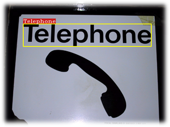

# ZOCR

A real-time scene text detection and recognition algorithm. Our system is able to recognize text in unconstrain background.  
This algorithm is based on several papers, and was implemented in C/C++ using ZedBoard DPU.

Prerequisites:
- Install [docker](https://docs.docker.com/install/)
- Install [dnndk v3.1](https://www.xilinx.com/products/design-tools/ai-inference/ai-developer-hub.html#edge) at project's dnndk directory

Tensorflow:
- `docker build -t xilinx-dnndk-builder-tensorflow -f builder/Dockerfile.tensorflow .`
- `docker run --rm -it -v $(pwd):/workdir -v "$HOME/.Xauthority:/root/.Xauthority:rw" -e DISPLAY --net=host xilinx-dnndk-builder-tensorflow`

No DNNDK builds:
- tf: `docker build -t xilinx-dnndk-builder-tensorflow-no-dnndk -f ./builder/Dockerfile.tensorflow-no-dnndk ./builder`

### Running Applications using ZedBoard
Prerequisites:
- (Windows Only) Install [MobaXterm](https://mobaxterm.mobatek.net/)
- Install [Etcher](https://www.balena.io/etcher/)

Setup:
- Download [DNNDK Linux image](https://www.xilinx.com/member/forms/download/design-license-xef.html?filename=xilinx-zedboard-dnndk3.1-image-20190812.zip)
- Install the DNNDK image on an SD-card (at leat 8GB) using etcher
- Place the SD card at the ZedBoard and turn on (make sure SD-card boot mode is enabled)
- Connect the ZedBoard to a LAN using ethernet
- Find the ZedBoard IP (either by connecting to its UART console or using a LAN scan tool like nmap)
- Transfer DNNDK tools to Zedboard: `scp -r dnndk/ZedBoard root@<zedboard-ip>:~/`
- Login to ZedBoard: `ssh root@<zedboard-ip>:~/` (default password is **root**)
- Install the DNNDK tools to Zedboard: `cd ZedBoard && ./install.sh`


Enviroment and dependency
-------- 
1. [OpenCV](http://opencv.org/) 2.3 or above using ZedBoard Peta Linux


How to build?
--------

### Peta Linux ZedBoard (linux Only for now)
Execute OCR Sample :

1. Login to ZedBoard: `ssh root@<zedboard-ip>:~/`

2. Transfer ZOCR application to Zedboard: `scp -r ZOCR root@<zedboard-ip>:~/`

3. Use Make to generate the project 
    ```sh
    cd ZOCR
    make
    ```
4.  Find the binaries in the root directory
    ```sh
    cd ..
    ls | grep scene
    ```
5.  To execute the binaries, run them as-is; for example:
    ```sh
    ./OCR -i res/ICDAR2015_test/img_6.jpg
    ```

Usage
---------
The executable file `OCR` must ultimately exist in the project root directory (i.e., next to `classifier/`, `dictionary/` etc.)
```
./OCR -i [image]:    take an image as input 
```
Future plans
```
./OCR -v:            take default webcam as input  
./OCR -v [video]:    take a video as input    
```
Result
----------

